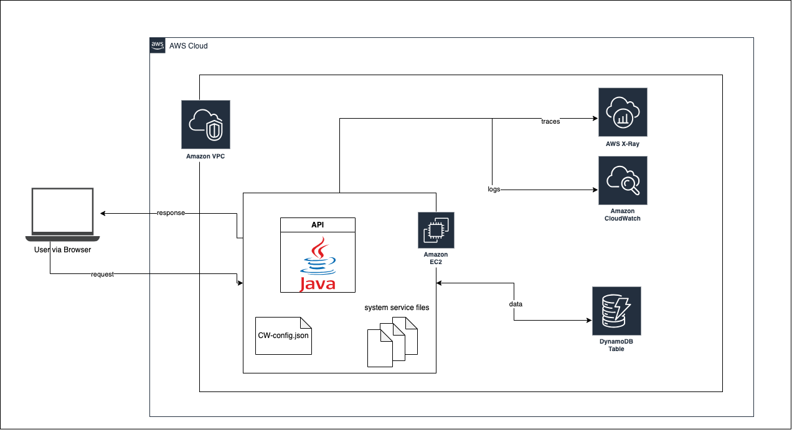

# Monitoring & Observability with Amazon CloudWatch and AWS X-Ray

## About
This project explores a configuring a Java API deployed on an EC2 instance to monitor logs and record traces using Amazon CloudWatch and AWS X-Ray.

The API used is a minimal Java API with `/post` and `/get` endpoints to save 4 rows of data to a DynamoDB table, and fetch each row using its ID.

## Setup 
- Open JDK 11
- Maven
- AWS X-Ray Daemon
- Amazon CloudWatch agent
- Amazon EC2
- AWS IAM
- Amazon DynamoDB
- Java API

## Pre-Requisites
- Familiarity with Java and/or building Java APIs (useful for debugging)
- An existing DynamoDB table for the API to store/retrieve data
- Familiarise with app code: this repo

## Architectural Diagram

## Learnings
- Deploying a Java app on an EC2 instance
- Security best practice with least privilege IAM roles
- Installing and configuring AWS X-Ray Daemon and CloudWatch agent
- Working with System Service files
- Exploring logs and traces within AWS console and directly in EC2 instances

## Documentation
- [Blog Post](https://khairahscorner.hashnode.dev/monitoring-java-apis-on-ec2-with-amazon-cloudwatch-and-aws-x-ray)
